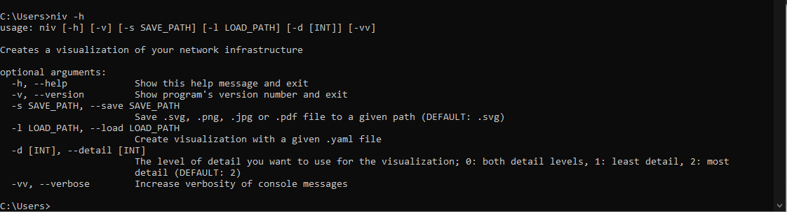
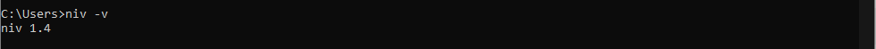
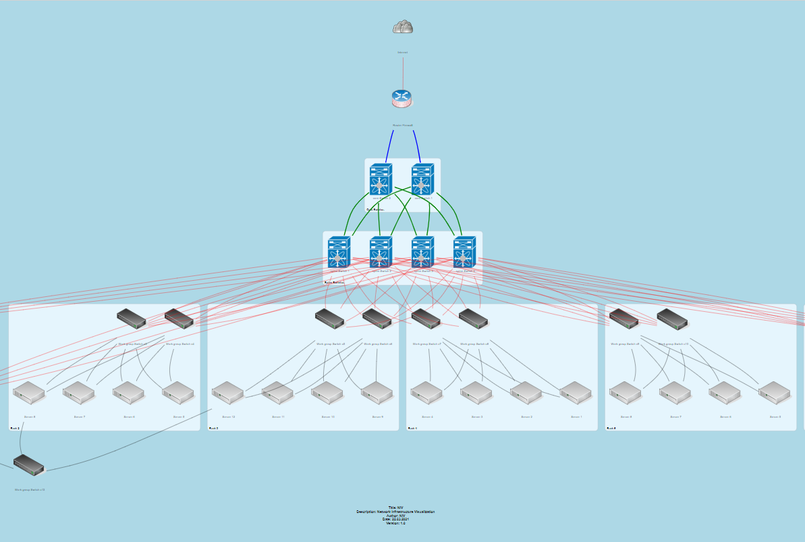
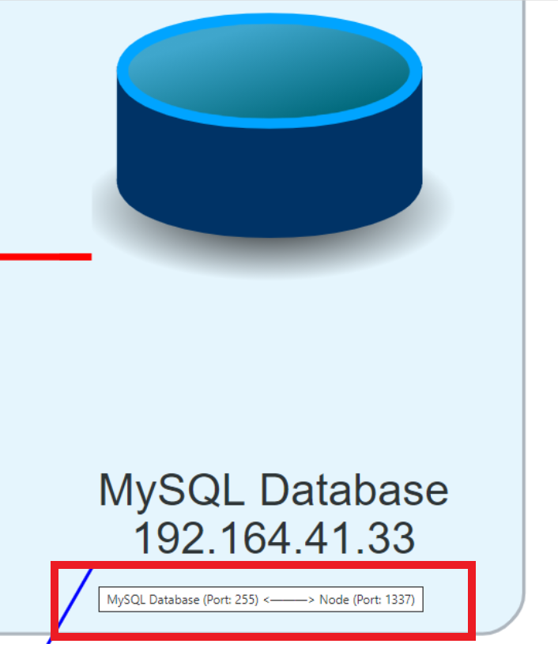
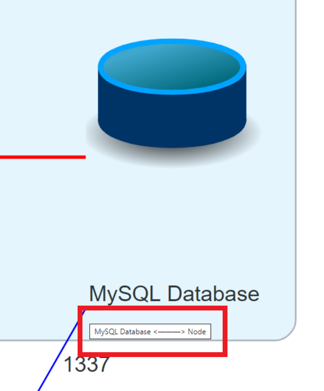

# Welcome to NIV!

Network diagrams are commonly drawn manually, using tools like Visio or Draw.io. This makes maintaining an up-to-date representation of dynamic network environments challenging. Currently, no modern tools appear to exist which can generate network drawings from code such as YAML. Such a machine readable format would allow administrators to automate the visualization of a topology and to track document changes using version control.

## Table of Contents
	 
- [Installation](#installation)
  * [System Requirments](#system-requirments)
 - [Arguments](#arguments)
 - [Help](#help)
 - [Version](#version)
 - [Create diagram](#create-diagram)
 - [Create And Save a Diagram](#create-and-save-a-diagram)
      * [Save As SVG](#save-as-svg-:)
      * [Save As PDF](#save-as-pdf-:)
      * [Save As PNG](#save-as-png-:)
 - [Detailed view](#detailed-view)
 - [Verbosity](#verbosity)

 

# Installation

NIV Packages are available on [Python Package Index](https://pypi.org/project/niv/)

```
pip install niv
````
### System Requirments

 - [Python 3.x–3.9](https://www.python.org/downloads/)
 - [pip 19.0 or higher](https://pip.pypa.io/en/stable/installing/)

# Arguments
| Argument | Functionality |
|--|--|
|[**-h, --help**](#help)|Show this help message and exit|
|[**-v, --version**](#version)|Show program's version number and exit|
|[**-l / --load load_path**](#create-diagram)|Create visualization with a given .yaml file  |
|[**-s / --save save_path**](#create-and-save-a-diagram)|Save .svg, .png, .jpg or .pdf file to a given path (DEFAULT: .svg)  |
|[**-d / --detail [INT]**](#detailed-view)| The level of detail you want to use for the visualization; 0: both detail levels , 1 : least detail, 2: most detail (default) |
|[**-vv, --verbose**](#verbosity)  | Increase verbosity of console messages |

# Help
***Example:***
```
niv -h
```
Will show you the arguments you can use and their functionality


# Version
***Example:***
 ```
niv -v
```
Will show you the version of the package you installed


# Create Diagram 

NIV can create network diagrams dynamically from a yaml file describing the placement, layout, groups and icons. Given a Yaml describing the hierarchy of the network and it's connections, a resulting svg diagram will be created.

***Example:***
```
niv -l load_path/example.yaml
```

# Create And Save a Diagram
To save the generated diagram you can pass the  [ -s ]   Argument with a given save_path and filename

### Save As SVG :

***Example:***
```
niv -l load_path/example.yaml -s save_path/your_file_name.svg
```
You can also save the diagram in other file formats.
### Save As PDF :

***Example:***
```
niv -l load_path/example.yaml -s save_path/your_file_name.pdf
```
### Save As PNG :

***Example:***
```
niv -l load_path/example.yaml -s save_path/your_file_name.png
```
# Detailed view
You can choose between three different detail levels
### Detail level 0 (default):
```
niv -l load_path/example.yaml 
```



### Detail level 1:
```
niv -l load_path/example.yaml -d 1
```


# Verbosity
```
niv -l load_path/example.yaml -vv
```
